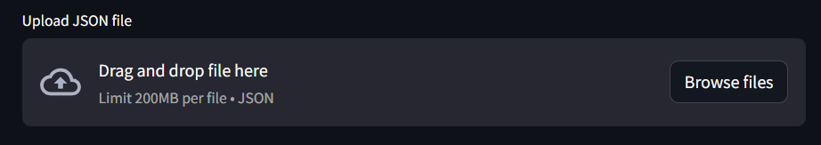

# Json to Excel Convertor

This script converts JSON files to Excel format using Python. It provides a simple web interface built with Streamlit for file upload and conversion.


## Installation

Used [Python](https://www.python.org/)  3.10.1 to run.

Install dependencies mentioned inside requirement.txt by opening terminal in project's directory and enter command.
```bash
pip install -r requirements.txt
```
## Files

- requirements.txt - Contains the libraries needed with version number.
- main.py - Converts Json data into xlsx type.
- data.json - Example Json file.
- output.xlsx - Example output excel file.

## Usage
- Install the required libraries:\
- Run the script

  ```bash
  streamlit run main.py
  ```
- Upload a JSON file:Click on "Upload JSON file" and select the JSON file you want to convert.
  
- Enter the output Excel file path:Enter the desired path for the output Excel file.
  
- Convert and download:Click on "Convert JSON to Excel" to start the conversion process.
  
- Once completed, the converted Excel file path will be displayed
  
